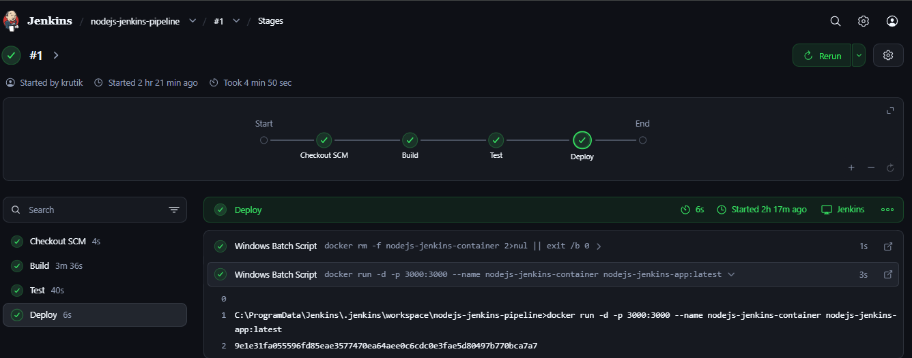
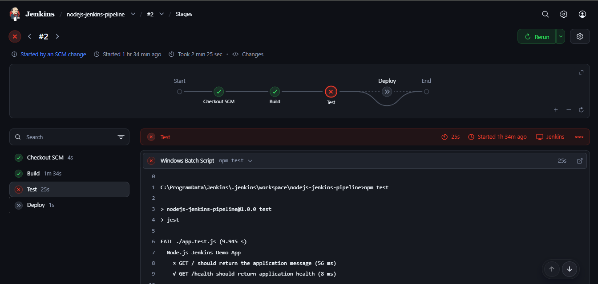
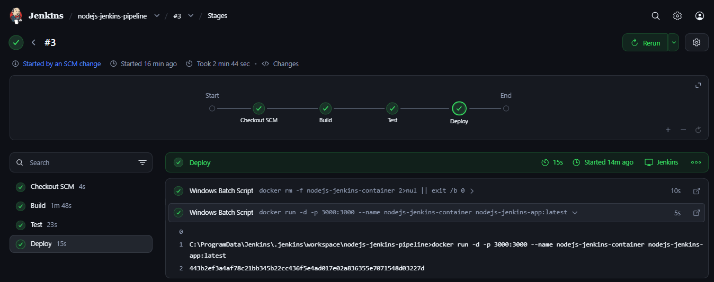

# Node.js CI/CD Pipeline with Jenkins and Docker

## Project Overview

This project demonstrates the implementation of an automated CI/CD pipeline for a containerized Node.js application using Jenkins and Docker.

The application is intentionally lightweight, as the primary focus of this project is to understand how Jenkins can automate the process of building, testing, and deploying an application.

Jenkins monitors the GitHub repository for changes using SCM polling. When a new commit is detected on the `main` branch, Jenkins automatically starts the pipeline.

The pipeline installs application dependencies, builds a Docker image, runs automated tests, and deploys the application as a Docker container only when the required stages complete successfully.

This repository also documents the troubleshooting performed while configuring Jenkins and Docker and while validating successful and failed CI/CD pipeline behavior.

---

## Tools and Technologies

- Node.js
- Express.js
- Jest
- Supertest
- Jenkins
- Docker
- Git
- GitHub
- Windows PowerShell
- Visual Studio Code

---

## Project Structure

```text
nodejs-jenkins-pipeline/
│
├── docs/
│   └── troubleshooting/
│       ├── docker-engine-not-running.md
│       ├── jenkins-docker-cli-not-found.md
│       └── jenkins-test-failure-deployment-skipped.md
│
├── screenshots/
│   ├── jenkins-automatic-success.png
│   ├── jenkins-pipeline-success.png
│   └── jenkins-test-failure.png
│
├── .dockerignore
├── .gitignore
├── Dockerfile
├── Jenkinsfile
├── README.md
├── app.js
├── app.test.js
├── package.json
├── package-lock.json
└── server.js
```

---

## Application Endpoints

### Home Endpoint

```text
GET /
```

Response:

```text
Hello from Jenkins Automated CI/CD Pipeline!
```

### Health Check Endpoint

```text
GET /health
```

Response:

```json
{
  "status": "OK"
}
```

---

## Running the Application Locally

### 1. Install Dependencies

```powershell
npm ci
```

### 2. Run Automated Tests

```powershell
npm test
```

### 3. Start the Application

```powershell
npm start
```

The application runs on:

```text
http://localhost:3000
```

The health endpoint can be accessed at:

```text
http://localhost:3000/health
```

---

## Running the Application with Docker

### Build the Docker Image

```powershell
docker build -t nodejs-jenkins-app:latest .
```

### Run the Docker Container

```powershell
docker run -d -p 3000:3000 --name nodejs-jenkins-container nodejs-jenkins-app:latest
```

The application can then be accessed at:

```text
http://localhost:3000
```

---

## Jenkins CI/CD Pipeline

The Jenkins pipeline is defined in the root-level `Jenkinsfile`.

Jenkins retrieves the `Jenkinsfile` from the GitHub repository and executes the pipeline on the Windows Jenkins agent.

The pipeline contains three main stages:

```text
GitHub Repository
       |
       v
Jenkins detects new commit
       |
       v
     Build
       |
       v
      Test
       |
       v
     Deploy
       |
       v
Docker Container
       |
       v
Node.js Application
```

---

## Build Stage

The Build stage installs the Node.js dependencies using:

```powershell
npm ci
```

It then builds the Docker image:

```powershell
docker build -t nodejs-jenkins-app:latest .
```

This creates the application image that can later be deployed if the pipeline validation succeeds.

---

## Test Stage

The Test stage executes the Jest automated tests:

```powershell
npm test
```

The tests validate the application's home and health endpoints.

If a test fails, Jenkins stops the pipeline before deployment and the Deploy stage is skipped.

This prevents an application change that fails its automated validation from being deployed.

---

## Deploy Stage

The Deploy stage first removes the previously deployed container if it exists:

```powershell
docker rm -f nodejs-jenkins-container 2>nul || exit /b 0
```

The `|| exit /b 0` portion allows the pipeline to continue when the container does not already exist.

The pipeline then starts a new container using the Docker image created during the Build stage:

```powershell
docker run -d -p 3000:3000 --name nodejs-jenkins-container nodejs-jenkins-app:latest
```

The application is exposed on port `3000`.

---

## Automatic Pipeline Trigger

Jenkins is running locally, so SCM polling is used to detect changes in the GitHub repository.

The Jenkins job is configured with the following Poll SCM schedule:

```text
H/2 * * * *
```

Jenkins periodically checks the repository for source-code changes. The `H` value allows Jenkins to choose a stable hashed minute rather than requiring all jobs to poll at exactly the same minute.

When Jenkins detects a new commit on the configured `main` branch, it automatically starts the pipeline.

The overall workflow is:

```text
Developer
    |
    v
Git Push
    |
    v
GitHub Repository
    |
    v
Jenkins SCM Polling
    |
    v
New Commit Detected
    |
    v
Build → Test → Deploy
```

SCM polling was used for this local Jenkins environment because the Jenkins server was running on `localhost` and was not publicly accessible for a GitHub webhook.

---

## Pipeline Validation

The pipeline was tested through multiple Jenkins builds to verify both successful and failed CI/CD behavior.

### Build #1 — Initial Successful Pipeline

The first Jenkins pipeline execution successfully completed all three stages:

```text
Build   → SUCCESS
Test    → SUCCESS
Deploy  → SUCCESS
```

The Docker container was deployed and the application was accessible on port `3000`.

### Build #2 — Test Failure

The application welcome message was intentionally changed without updating its corresponding Jest test.

Jenkins detected the new commit through SCM polling and automatically started Build #2.

The result was:

```text
Build   → SUCCESS
Test    → FAILED
Deploy  → SKIPPED
```

Because the Test stage failed, Jenkins did not execute the Deploy stage.

The previously deployed working Docker container remained running, so the failed application change was not deployed.

This demonstrated how automated testing can act as a deployment gate in the CI/CD pipeline.

### Build #3 — Successful Build After the Fix

The Jest test was updated to match the intended application response and the correction was pushed to GitHub.

Jenkins detected the new commit through SCM polling and automatically started Build #3.

The pipeline completed successfully:

```text
Build   → SUCCESS
Test    → SUCCESS
Deploy  → SUCCESS
```

The previous Docker container was replaced with a container running the updated application.

The application then returned:

```text
Hello from Jenkins Automated CI/CD Pipeline!
```

This demonstrated both automatic pipeline triggering and test-gated deployment.

---

## Screenshots

The following screenshots demonstrate the Jenkins CI/CD pipeline behavior during successful and failed pipeline executions.

### Successful Jenkins Pipeline

The initial Jenkins pipeline successfully completed all three stages: **Build, Test, and Deploy**.



### Test Failure and Skipped Deployment

After the application response was intentionally changed without updating the corresponding test, Jenkins detected the new commit and started the pipeline automatically.

The **Test** stage failed and the **Deploy** stage was skipped, preventing the failed application change from being deployed.



### Successful Automatic Pipeline After the Fix

After correcting the automated test and pushing the change to GitHub, Jenkins detected the new commit through SCM polling.

The pipeline successfully completed **Build, Test, and Deploy**, and the updated application was deployed.



---

## Troubleshooting

During this project, several real issues were encountered while configuring Docker and Jenkins and while validating the CI/CD pipeline.

### Docker Engine Not Running

The Docker CLI was installed, but the Docker Desktop engine was unavailable during prerequisite verification.

[View detailed troubleshooting](docs/troubleshooting/docker-engine-not-running.md)

### Jenkins Could Not Find the Docker CLI

Docker commands worked from the logged-in Windows user's PowerShell terminal but were initially unavailable to the Jenkins service environment.

[View detailed troubleshooting](docs/troubleshooting/jenkins-docker-cli-not-found.md)

### Jenkins Test Failure and Skipped Deployment

An intentional application/test mismatch caused the Test stage to fail. Jenkins correctly skipped deployment and left the previously deployed working container running.

[View detailed troubleshooting](docs/troubleshooting/jenkins-test-failure-deployment-skipped.md)

---

## What I Learned

Through this project, I gained hands-on experience with:

- Installing and configuring Jenkins on Windows.
- Creating and configuring a Jenkins Pipeline job.
- Writing a Declarative Jenkins Pipeline using a `Jenkinsfile`.
- Understanding Jenkins stages and pipeline execution.
- Integrating a GitHub repository with Jenkins.
- Configuring SCM polling to automatically detect repository changes.
- Using `npm ci` for dependency installation in a CI/CD pipeline.
- Integrating Jest automated tests into Jenkins.
- Using automated tests as a deployment gate.
- Building Docker images through Jenkins.
- Deploying a Node.js application as a Docker container.
- Understanding the difference between the Docker CLI and Docker engine.
- Understanding differences between a logged-in user's environment and the Jenkins service environment.
- Troubleshooting Jenkins, Docker, and CI/CD pipeline failures.
- Verifying both successful and failed pipeline behavior.

---

## Conclusion

This project demonstrates a basic automated CI/CD workflow for a containerized Node.js application using Jenkins and Docker.

Jenkins monitors the GitHub repository using SCM polling and automatically starts the pipeline when a new commit is detected. The pipeline installs dependencies, builds a Docker image, executes automated tests, and deploys the application as a Docker container when validation succeeds.

The intentional test failure demonstrated an important CI/CD principle: successfully completing the Build stage alone does not mean that an application change should be deployed. The application must also pass its automated validation before reaching the Deploy stage.

The project provided practical experience with Jenkins pipelines, Docker-based deployment, automated testing, SCM integration, and CI/CD troubleshooting.